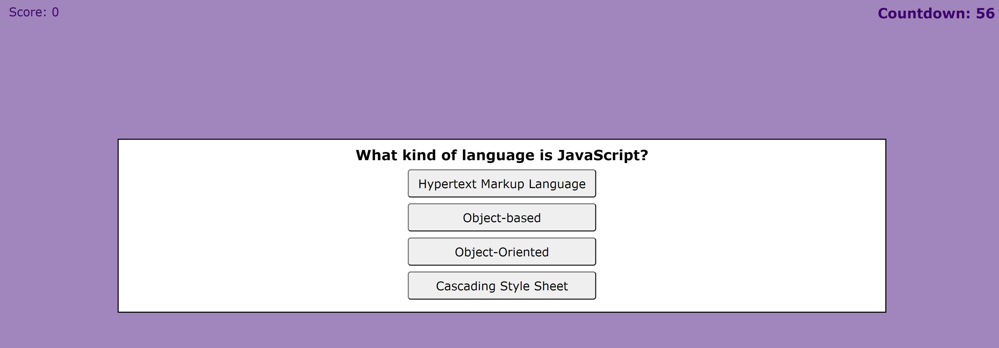

# Timed Code Quiz

## Description
As part of the interview process when you apply as a full-stack web developer, you might be given a coding assessment. This assessment consists of multiple-choice questions. The purpose of this quiz is to equip you with JavaScript fundamentals and help you familiarize some of the questions that could be asked at an interview.

## Task
To take a timed quiz, the following requirements are met when:
- The timer starts and the questions are presented after I click the start button.
- Answering the right question presents me with the next question.
- Answering the wrong question reduces time from the timer. 
- After all the questions are answered or the timer reaches 0, the game is over.
- I can save my score with my initials.

## Screenshot

## Link to the Final Page
[Link to the final code quiz web page]https://inna-arabejo.github.io/web-api-code-quiz/

## Sources
- https://www.interviewbit.com/javascript-mcq/
- https://michael-karen.medium.com/how-to-save-high-scores-in-local-storage-7860baca9d68
- https://www.sitepoint.com/simple-javascript-quiz/
